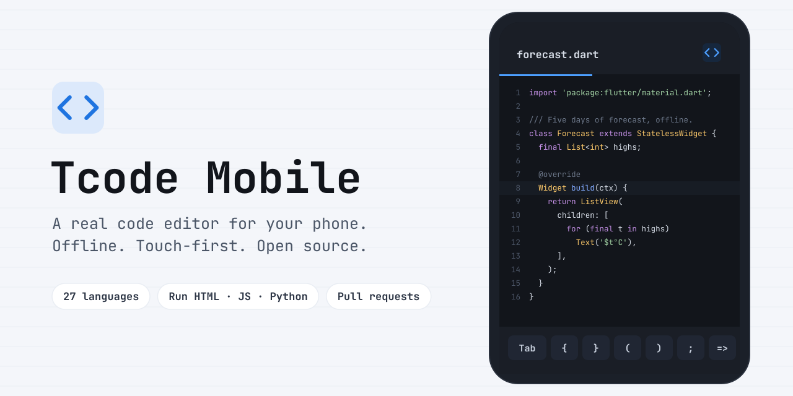
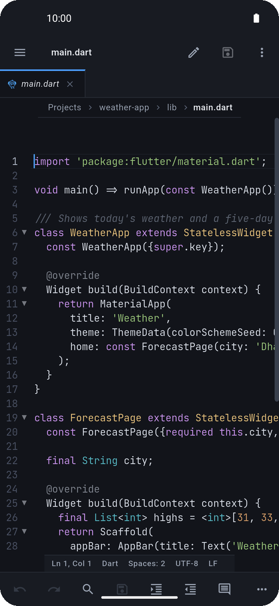
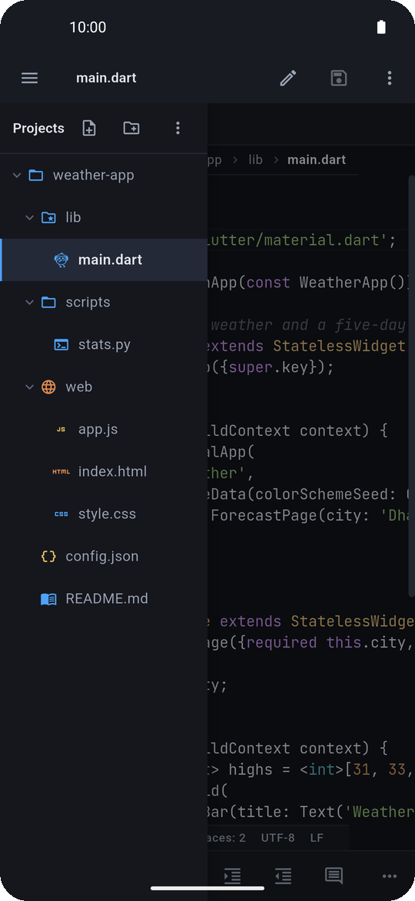
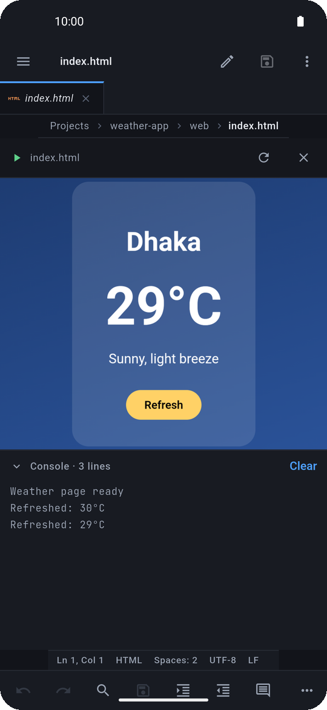
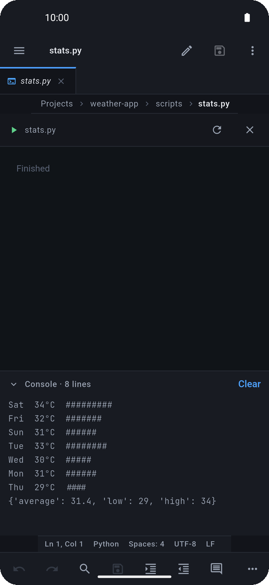
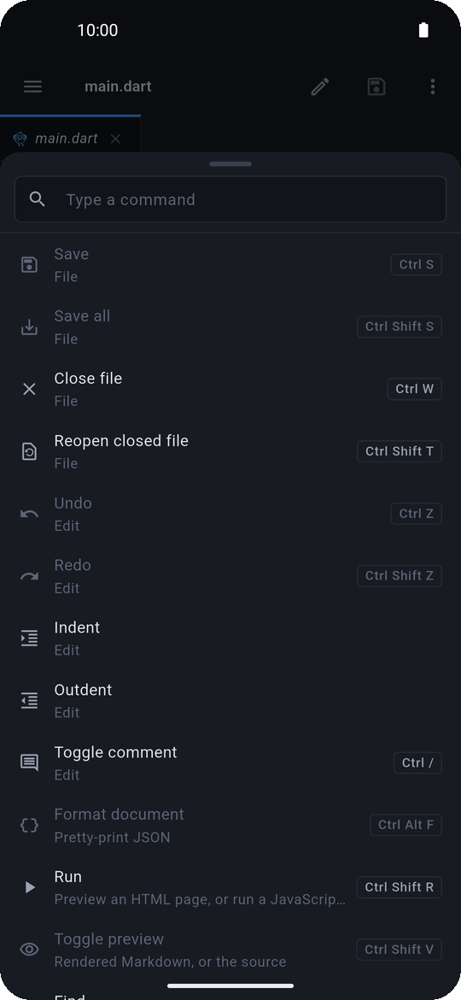
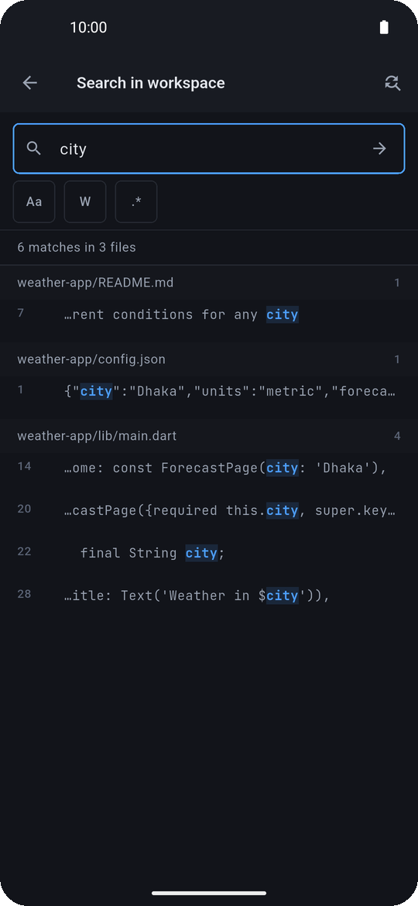
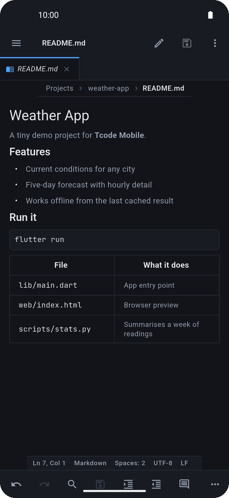
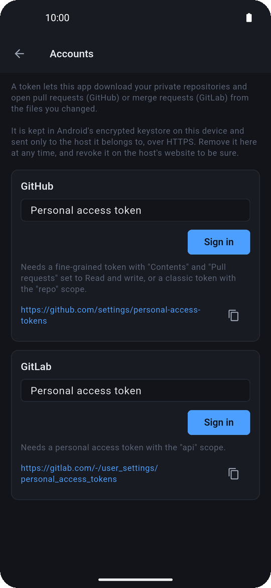

<picture>
  <source media="(prefers-color-scheme: dark)" srcset="docs/readme/banner-dark.svg">
  
</picture>

# Tcode Mobile

<p>
  <a href="https://github.com/tanim913/tcode-mobile/releases/latest"></a>
  
  
  
  
</p>

**Tcode Mobile** is a free, open-source code editor for Android, built for a phone screen and a thumb, not a
desktop editor squeezed onto one. Open a folder, edit with real syntax
highlighting, search the whole project, run an HTML page or a Python script,
and send your changes back to GitHub as a pull request. It all runs on the
phone itself. There is no account to create, no server behind it, and no
telemetry.

<p align="center">
  <a href="https://github.com/tanim913/tcode-mobile/releases/latest"><b>⬇&nbsp; Download the latest APK</b></a>
  &nbsp;·&nbsp; <a href="https://tanim913.github.io/tcode-mobile/">Website</a>
  &nbsp;·&nbsp; <a href="#install">How to install</a>
  &nbsp;·&nbsp; <a href="#features">All features</a>
</p>

<p align="center">
  
  
  
  
</p>
<p align="center">
  
  
  
  
</p>

## What makes it different

- **Made for touch.**
  - Pinch with two fingers to zoom the code. It never starts a text
    selection by accident.
  - A row of coding keys sits above the keyboard: Tab, Shift, arrows and
    brackets.
  - Every button is a full-size touch target.
  - Tap a word suggestion to accept it.
- **Runs your code with no internet.** HTML pages open with their own CSS and
  JavaScript, and a console shows the output. JavaScript errors point at the
  right line of *your* file. Python scripts run on MicroPython, which is built
  into the app.
- **GitHub and GitLab without git.** Download any repository by pasting its
  link. With a token you can also download private repositories and turn your
  edits into a pull request (a merge request on GitLab).
  - The app shows exactly which files you added, changed or deleted, and you
    can see the difference in each one before sending.
  - If you can't push to the repository, the app forks it for you.
- **Hard to lose work.**
  - Auto-save.
  - Unsaved changes survive the app being killed.
  - Every save keeps the earlier version, so you can compare and restore.
  - A warning appears when a file changes on disk.
  - Encodings, line endings and BOMs are kept exactly as they were.
- **Private by design.** There is no telemetry and no account. The offline
  edition asks for **no permissions at all**, so it cannot reach the internet
  even in principle. Tokens, if you add one, stay in Android's encrypted
  keystore and are only ever sent to the host they belong to.
- **Keeps up with big projects.** Search, copy, delete and ZIP work in the
  background, so the editor stays responsive while they run.

## Features

<details open>
<summary><b>Editing</b></summary>

- Syntax highlighting for 27 languages:
  - Dart, JavaScript, TypeScript, JSON;
  - HTML, XML, CSS, SCSS;
  - Python, Java, Kotlin, Swift;
  - C, C++, C#, Go, Rust;
  - PHP, Ruby, Shell, SQL, Lua;
  - YAML, TOML, Markdown, Dockerfile, Makefile.
- Code folding: by braces, and by indentation for Python and YAML.
- Word completion as you type, from the file's own words and the language's keywords.
- Snippets: insert from the palette, and write your own.
- Undo and redo, indent and outdent, toggle comment, jump to the matching bracket.
- Find and replace in a file, with case, whole-word and regex options.
- Themes: Pocket Dark, Pocket Light and Ember. The app itself can be light, dark or high contrast.
- Fonts: JetBrains Mono and Fira Code. You can change the size, tab width and word wrap.
- A lock button that makes a file read-only, so you can scroll without typing by accident.

</details>

<details>
<summary><b>Files and projects</b></summary>

- Open the app's own Projects folder, any folder on the phone (through Android's
  folder picker), or a downloaded repository.
- Explorer:
  - create, rename, duplicate and delete, with undo;
  - cut, copy and paste, drag to move, and select several at once;
  - copy a file's path.
- Share a file, or open it in another app.
- Import a project from a ZIP, or export a folder as one.
- Tabs:
  - a preview tab, which becomes permanent once you edit it;
  - drag to reorder;
  - close others or everything to the right;
  - reopen a tab you closed.
- Recent folders and files on the start screen.
- Images open in a viewer. Binary and very large files open read-only instead of freezing the app.

</details>

<details>
<summary><b>Finding things</b></summary>

- A command palette with every action. Keyboard shortcuts work when a hardware
  keyboard is attached.
- Go to file (fuzzy), go to line, and an outline of the file's symbols.
- Search the whole project and replace everywhere. Before replacing, it confirms
  the exact number of files and matches.
- Find in Folder: long-press a folder to search only inside it.
- Breadcrumbs above the editor.

</details>

<details>
<summary><b>Running and previewing</b></summary>

- Run an HTML page with its CSS, JavaScript and images, fully offline.
- Run JavaScript, with a console that reports the right line numbers.
- Run Python with MicroPython. It is real Python syntax with a smaller standard
  library: there is no pip and there are no third-party packages.
- Markdown preview.
- Format JSON.

</details>

<details>
<summary><b>History and safety</b></summary>

- Auto-save after a delay, or when you leave the app.
- Hot exit: unsaved edits come back after the app is killed.
- Local file history: every save keeps the version before it. You can compare
  it with now and restore it. How much is kept is up to you.
- Compare with saved: see what you changed before saving.
- A banner when a file changes on disk, offering to reload it or keep your version.

</details>

<details>
<summary><b>GitHub and GitLab</b> (standard edition)</summary>

- Download a repository at any branch: paste the page link, the `.git` link,
  or `owner/name`.
- Settings → Accounts: paste a personal access token. The app checks it with
  the host before saving it.
- Private repositories download once a token is added.
- Create a pull request (GitHub) or a merge request (GitLab):
  - see the changed files marked Added, Modified or Deleted, with a diff for each;
  - pick which files to include;
  - write the title, description, commit message and branch name;
  - get a link to the request when it is opened.

</details>

## Install

1. Open the [latest release](https://github.com/tanim913/tcode-mobile/releases/latest)
   on your phone and download the APK that fits it:

   | File | For |
   |---|---|
   | `tcode-mobile-vX.Y.Z-arm64-v8a.apk` | **Almost every phone from the last 7 years.** Start here. |
   | `tcode-mobile-vX.Y.Z-armeabi-v7a.apk` | Older 32-bit phones. |
   | `tcode-mobile-offline-vX.Y.Z-arm64-v8a.apk` | The offline edition (see below). |
   | `tcode-mobile-offline-vX.Y.Z-armeabi-v7a.apk` | The offline edition, 32-bit. |

2. Open the downloaded file. If Android asks, allow your browser to
   **install unknown apps**.
3. If Play Protect warns that it doesn't recognise the app, choose **Install
   anyway**. It says that about any app not installed from the Play Store.

**Updating:** install the newer APK over the old one. Your projects and
settings stay.

<details>
<summary><b>Two editions: standard and offline</b></summary>

| | Standard | Offline |
|---|---|---|
| Editing, running, search, history | ✓ | ✓ |
| Download repositories, pull requests | ✓ | – |
| Android permissions | Internet, plus all-files access (declared for a future feature, not yet requested) | **none** |
| App id | `dev.tcode.mobile.full` | `dev.tcode.mobile` |

The two have different app ids, so both can be installed side by side.

</details>

<details>
<summary><b>Check that an APK is genuine</b></summary>

Every release is signed with the same key. Its SHA-256 certificate fingerprint is:

```
CF:B7:DD:71:8B:FE:C5:DE:D0:D9:87:18:0E:69:D9:9D:AE:4F:40:E8:DE:9F:A8:A5:92:97:DF:FF:38:71:1B:C2
```

Check it with `apksigner verify --print-certs <file>.apk`. Each release also
lists the SHA-256 of every file in `SHA256SUMS.txt`.

</details>

## Build from source

You need the [Flutter SDK](https://docs.flutter.dev/get-started/install)
(stable channel, Dart 3.13 or newer) and the Android SDK.

```bash
git clone https://github.com/tanim913/tcode-mobile.git
cd tcode-mobile
flutter pub get
flutter test                                   # the whole suite should pass
flutter run --flavor full                      # on a connected phone or emulator
flutter build apk --release --flavor full --split-per-abi
```

`--flavor play` builds the offline edition. Without the project's signing key,
release builds are signed with your own debug key. That is fine for your own
phone, but that APK cannot update an official release.

Before changing code, read [docs/ARCHITECTURE.md](docs/ARCHITECTURE.md). It
explains the layers, the rules that keep them apart, and the traps that have
already been found.

## Versions

Releases follow [semantic versioning](https://semver.org): `MAJOR.MINOR.PATCH`.

- **PATCH** is for fixes.
- **MINOR** is for new features.
- **MAJOR** is for anything that changes how existing projects or settings behave.

Every release is a git tag `vX.Y.Z`, with its notes in
[CHANGELOG.md](CHANGELOG.md). Android's internal version code only ever goes
up, which is what lets a new APK install over the old one.

## Honest limits

- It is not git. There is no clone, pull, merge or history. A pull request is
  made against the version you downloaded, and if the repository has moved on,
  GitHub or GitLab shows the conflicts.
- GitLab support is gitlab.com only, without subgroups.
- Python means MicroPython: no pip and no third-party packages.
- Downloaded repositories are limited to 100 MB zipped and 20,000 files. Larger
  ones are refused rather than filling your phone.
- Code formatting is JSON only.
- Android only for now. The platform code sits behind interfaces, so iOS is
  possible later.

## License

[MIT](LICENSE) © tanim913.

Bundled third-party work:
- [MicroPython](https://micropython.org), MIT: see `assets/micropython/LICENSE`.
- [JetBrains Mono](https://github.com/JetBrains/JetBrainsMono) and
  [Fira Code](https://github.com/tonsky/FiraCode), SIL Open Font License 1.1:
  see `assets/fonts/OFL.txt`.
